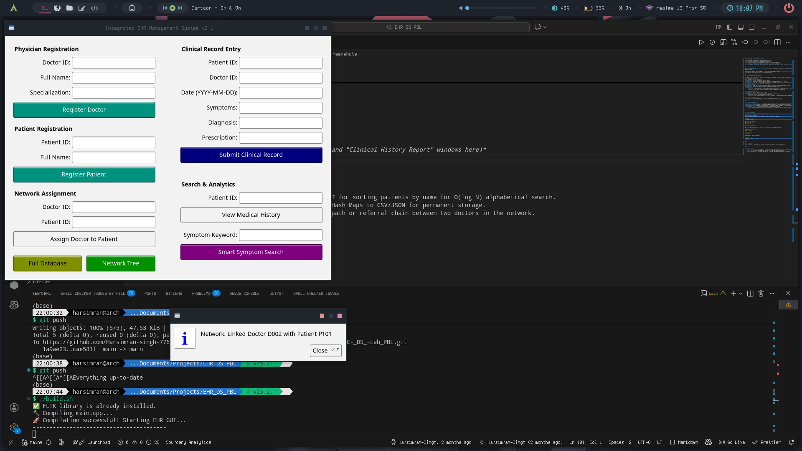

#  Integrated EHR Management System (DS PBL)


-lightgrey.svg)

> **A Project-Based Learning (PBL) submission exploring the practical application of Linked Lists, Hash Maps, and Graphs in healthcare data management.**

---

##  Project Overview
The **Integrated EHR (Electronic Health Record) System** is a C++ desktop application designed to manage complex relationships between doctors, patients, and their medical histories. 

Unlike standard database apps, this project is built from the ground up to demonstrate **core Data Structure concepts**, focusing on memory efficiency, algorithmic retrieval speed (Big-O optimization), and dynamic data handling.

---

##  Data Structures Analysis (The Core)

This project does not simply store data; it structures data for optimal performance. Below is the breakdown of the structures used, where they are implemented, and the rationale behind them.

### 1. Hash Maps (`std::unordered_map`)
* **Where used:** `patients` registry and `doctors` registry.
* **Purpose:** To store Patient and Doctor objects mapped by their unique String IDs (e.g., "P101").
* **DS Rationale:** * We need **O(1)** average time complexity for lookups. When a user searches for a Patient ID, we shouldn't iterate through a list (O(N)); the Hash Map allows instant retrieval regardless of database size.

### 2. Doubly Linked Lists
* **Where used:** Inside the `Patient` struct (`historyHead`, `historyTail`) to store `MedicalRecord` nodes.
* **Purpose:** To maintain a chronological timeline of a patient's medical history.
* **DS Rationale:**
    * **Dynamic Growth:** Medical history grows indefinitely; arrays would require expensive resizing.
    * **O(1) Insertion:** New records are always added to the end (`historyTail`). A linked list allows appending without shifting elements.
    * **Traversal:** We can easily traverse forward (or backward, if needed) to generate reports.

### 3. Graphs (Adjacency Lists)
* **Where used:** `adjList` (Doctor-Patient Network).
* **Purpose:** To model the Many-to-Many relationship between Doctors and Patients.
* **DS Rationale:**
    * A Matrix (N*N) would be too sparse and memory inefficient.
    * An **Adjacency List** is space-efficient **O(V + E)**, allowing us to quickly visualize exactly which patients are assigned to a specific doctor and vice versa.

### 4. Vectors (`std::vector`)
* **Where used:** Inside the adjacency list to hold the edges (neighbor IDs).
* **Purpose:** To provide a dynamic array that stores the connections for the graph nodes.

---

## 🛠 Features & Algorithms

* **Physician & Patient Registration:** Uses Hash Map collision handling (internal to STL) to ensure unique IDs.
* **Clinical Record Entry:** Creates a new Linked List Node and appends it to the specific patient's history.
* **Network Visualization:** Performs a graph traversal to print a hierarchical "Tree View" of Doctor-Patient connections.
* **Smart Symptom Search:** * *Algorithm:* Linear Search with String Transformation.
    * *Logic:* Iterates through patient histories, converts text to lowercase, and performs substring matching to find records by keywords (e.g., "cardio", "pain").


###  Dijkstra’s Algorithm (Shortest Path)
* **Feature:** "Referral Path Finder"
* **Goal:** Find the shortest connection chain between any two people (e.g., Doctor A -> Patient X -> Doctor B).
* **Logic:**
    1.  Initialize all distances to Infinity ($\infty$), Source to 0.
    2.  Push Source into a **Min-Heap**.
    3.  Extract the node with the smallest distance.
    4.  **Relaxation:** Check all neighbors. If a shorter path is found via the current node, update the distance and push to Heap.
    5.  **Backtracking:** Use a `parent` map to reconstruct the path from Target to Source.
* *Note:* Currently, all edge weights are set to **1 (Uniform Cost)**. Using Dijkstra instead of BFS makes the system "future-proof" for features like *Trust Scores* or *Physical Distances*.

### 🔍 Smart Search (String Transformation)
* **Goal:** Case-insensitive substring matching for symptoms.
* **Complexity:** Linear Scan **O(N*M)** where N is records and M is string length.

---
---


##  Installation & Setup

This project uses **FLTK** (Fast Light Toolkit) for the GUI.

### Prerequisites (Arch Linux)
Since the team operates on Arch Linux, the build script is optimized for `pacman`.

```bash
# 1. Install dependencies
sudo pacman -S fltk

# 2. Clone the repository
git clone <repo-url>
cd EHR_DS_PBL
````

### Compiling & Running

We have included a custom build script that handles dependency checking and compilation.

```bash
# Give execution permission
chmod +x build.sh

# Run the system
./build.sh
```

*Alternatively, manual compilation:*

```bash
g++ main.cpp -lfltk -o ehr_gui
./ehr_gui
```

-----

##  Screenshots



-----

##  Future Scope

  * **Binary Search Tree (BST):** Implementing a BST for sorting patients by name for O(log N) alphabetical search.
  * **File I/O:** Serializing the Linked Lists and Hash Maps to CSV/JSON for permanent storage.
  

-----

